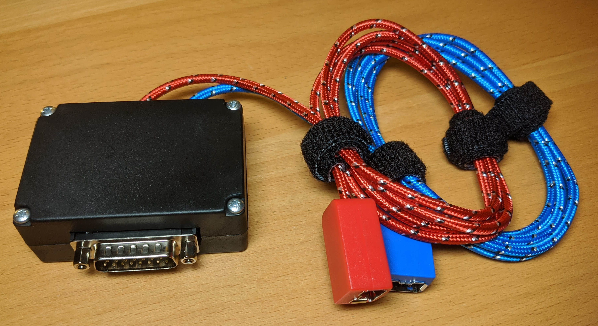
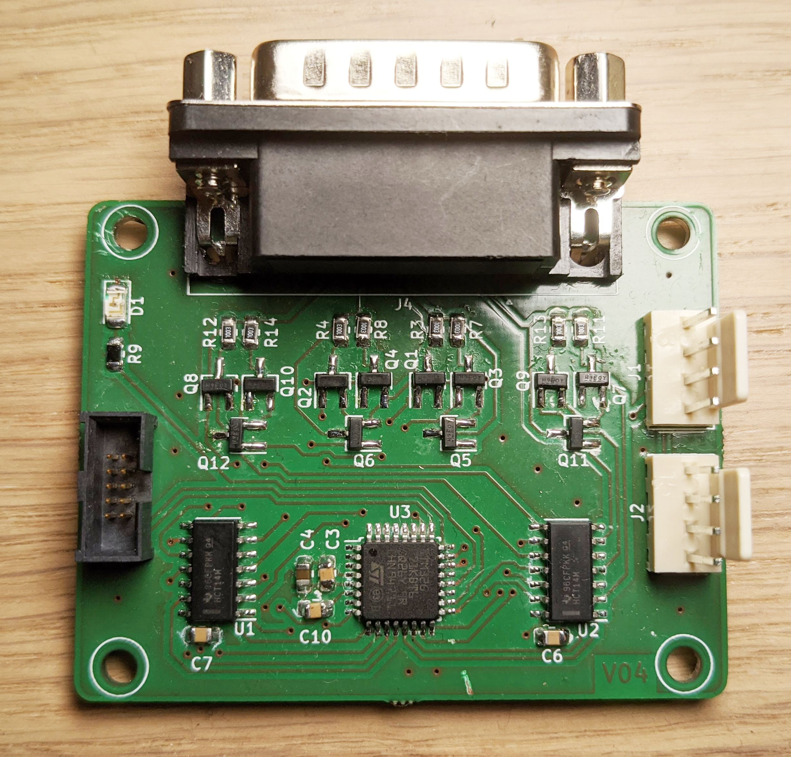
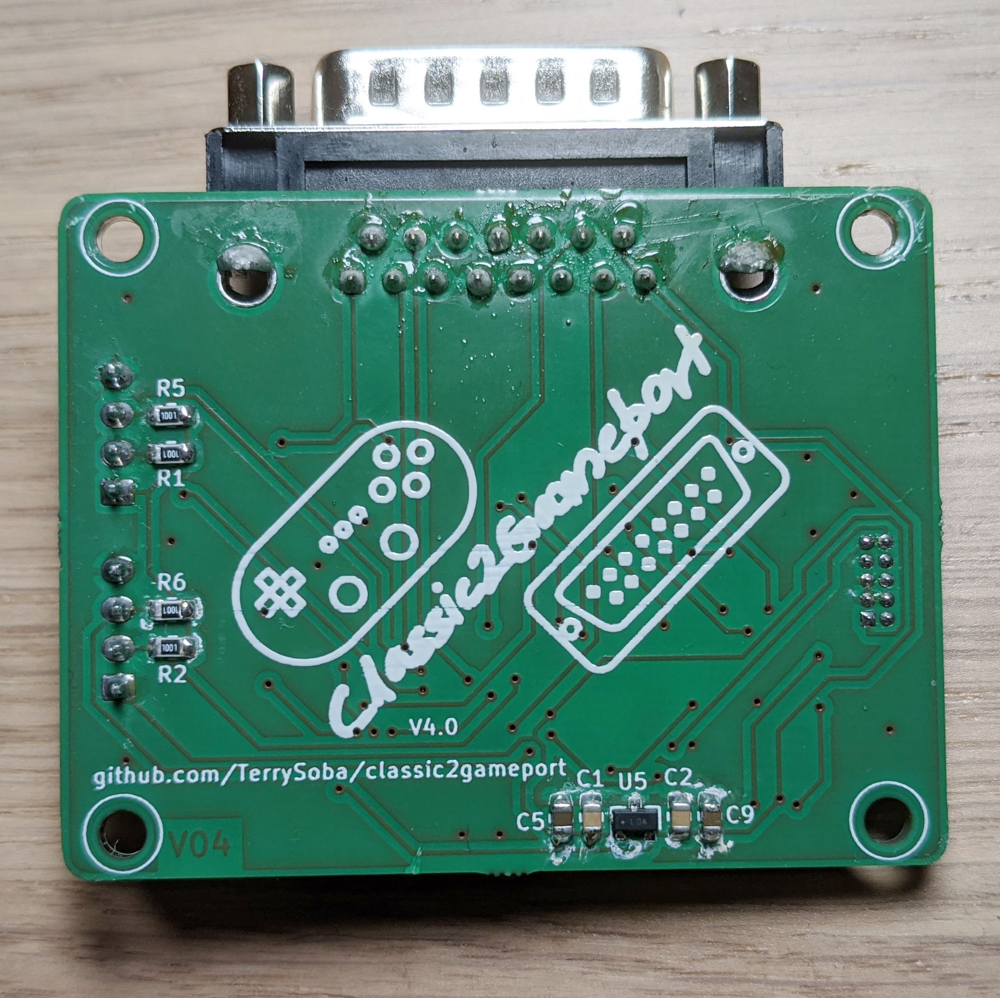

Classic2Gameport
================

About
-----
Classic2Gameport is an adapter that allows to connect up to two [Nintendo Wii Classic Controllers](https://en.wikipedia.org/wiki/Classic_Controller) to [PC Gameports](https://en.wikipedia.org/wiki/Game_port).
The adapter acts like a Gravis Gamepad.

Supported Devices
-----------------

The following Nintendo controllers are supported:
 * Classic Controller
 * Classic Controler Pro
 * SNES Mini Controller

The PC needs to have a Gameport to use this adapter.

Adapter Modes
-------------

| Mode | Combination | Description |
|------|-------------|--|
| Normal Mode | SELECT + DOWN | Button B -> 1 Button Y -> 2 Button A -> 3 Button X -> 4 |
| Two Player Mode | (connect two controllers) | Button B1 -> 1 Button Y1 -> 2 Button B2 -> 3 Button Y2 -> 4 
| Jump'n'Run Mode | SELECT + UP | Button Y -> 1 Button A -> 2 Button B -> Up |

Building Instructions
---------------------

Here are some images of the assembled adapter:

The Kicad files of the PCB can be found in the pcb directory of the repository.

The firmware for the ST STM32G071KxT microcontroller can be found in the firmware directory.